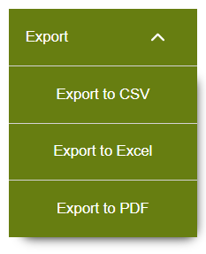
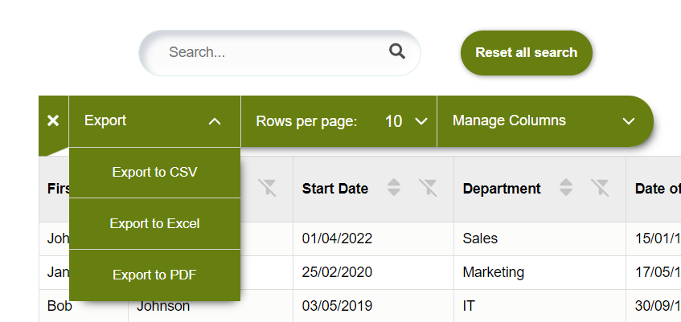
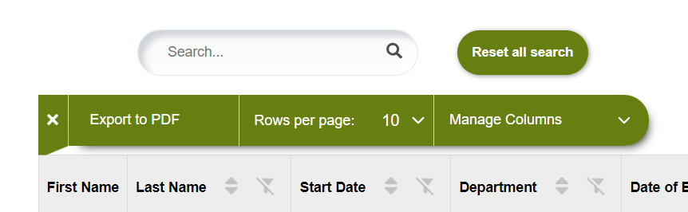
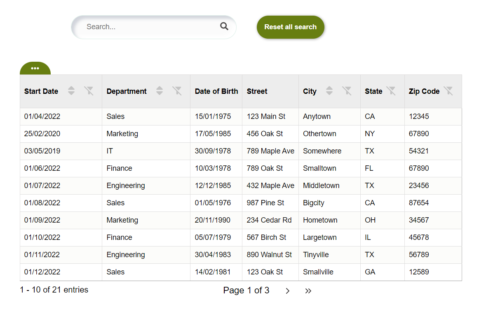
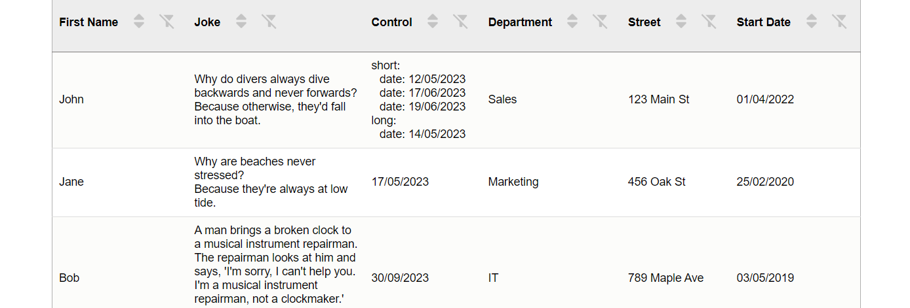

# 'typescript-exportdata': A package for easily importing ExportDataComponent dropdown with buttons to export a data of table.

The ExportDataComponent React and typescript component allows you to export table data in various formats. It is 100% customizable, accessible.


ExportDataComponent is an accessible and stylized React and typescript component in the form of a dropdown menu, allowing you to export table data in various formats such as CSV, Excel, and PDF. The number of export formats is customizable and can be tailored to your needs.
this package was specially created to work with the Table component of typescript-table but but it can be used elsewhere.

# Features

  Pre-buid and customize, export data dropDown to:
  - csv, 
  - excel
  - pdf 
  - Customizable
  - Accessible (focus, tabulation and aria-label)

## Install the package 
with npm:

    `npm install file-saver xlsx jspdf jspdf-autotable`

    `npm install typescript-exportdata`

or yarn:

    `yarn add typescript-exportdata`

## Import in your application

  `import { ExportDataComponent } from 'typescript-exportdata';`

Use the component like this with importing ExportDataComponent(dropdown to export data):

```js
  <ExportDataComponent
      filteredData={filteredData} //don't change this
      columnsManaged={columnsManaged}  //don't change this
      headerProperty='label'  // label is the property used to give the custom name for the column headers
      csvExport={true} // to have an export bouton for csv format
      excelExport={true} // to have an export bouton for excel format
      pdfExport={true} // to have an export bouton for pdf format
    />
```

```js
const columnsExample: Column[] = [
    { label: 'First Name', property: 'firstName', isVisible:true },
    { label: 'Last Name', property: 'lastName' , isVisible:true },
    { label: 'Start Date', property: 'startDate', isVisible:true },
    { label: 'Department', property: 'department', isVisible:true },
    { label: 'Date of Birth', property: 'dateOfBirth', isVisible:false}  //isVisible: false to make the data of this column hidden
];
```



Each column should be an object with the following properties:

  - property (required): The name of the property in the data that represents the value of the column.
  - headerProperty (optional): The property chosen to give the custom name for the column headers. If provided, it will be used instead of the property property.  The property property will be used as the default column header
  - isVisible (optional): A boolean value to determine if the column should be included in the export. If no column has isVisible set to true or if the isVisible property is absent from all columns, all columns will be included in the export by default. If you want to include only specific columns in the export, set isVisible to true for those specific columns.

When you export data, the system takes into account the isVisible property of each column. "By default, if no column has the isVisible property set to true, or if the isVisible property is absent from the columns, all columns will be included in the export.

If you wish to customize the export and only include certain columns, you can do so by setting the isVisible property to true for those specific columns. For instance, if you have a 'Price' column and you want it included in the export, make sure that isVisible is set to true for that column.

Note that if at least one column has isVisible set to true, only those columns will be included in the export. Columns without isVisible set or with isVisible set to false will be excluded from the export."

## Use ExportDataComponent after install 'typescript-table': 

Exemple ExportDataComponent with Table.



Install before using buttons's functionality.

`npm install file-saver xlsx jspdf jspdf-autotable`

after

  `import {Table} from 'typescript-table'`

  `import {ExportDataComponent} from 'typescript-exportData'`

```js
  <Table
    data={datasExample} // data to display
    columns={columnsExample} // columns to display
    renderExportDataComponent={(filteredData,columnsManaged) => (
      <ExportDataComponent
        filteredData={filteredData} //don't change this
        columnsManaged={columnsManaged}  //don't change this
        headerProperty='label' //don't change this
        csvExport={true} // to have an export bouton for csv format
        excelExport={true} // to have an export bouton for excel format
        pdfExport={true} // to have an export bouton for pdf format
      />
    )}
  />
```

you can choice to display just one bouton to export, exemple with the pdf button :



```js
    <Table
      data={datasExample}
      columns={columnsExample}
      renderExportDataComponent={(filteredData, columnsManaged) => (
        <ExportDataComponent
          filteredData={filteredData} // don't change this props
          columnsManaged={columnsManaged} // don't change this props
          pdfExport={true} // just this
        />
      )}
    />
```

## Exemple of use
****************************************************************************************************************

```diff	
@@ Example: Table of employees @@
```





****************************************************************************************************************

To use this package, you can use the examples like the data in the following example.

## Customize the style'component

To customize the style of the component, you can increase the specificity of your CSS rules. This means that you can target the component more precisely by adding more specific selectors to your CSS rules.

For example, to change the background color of the th of the table, you can use the following CSS rule

## Hiring the author
If you want to hire my services, don’t hesitate to drop me a line at the email address listed in my GitHub profile.

#### License

This project is licensed under the MIT License - see the [LICENSE]((https://github.com/palacioscaroline/typescript-table/blob/master/LICENSE).) file for details.


