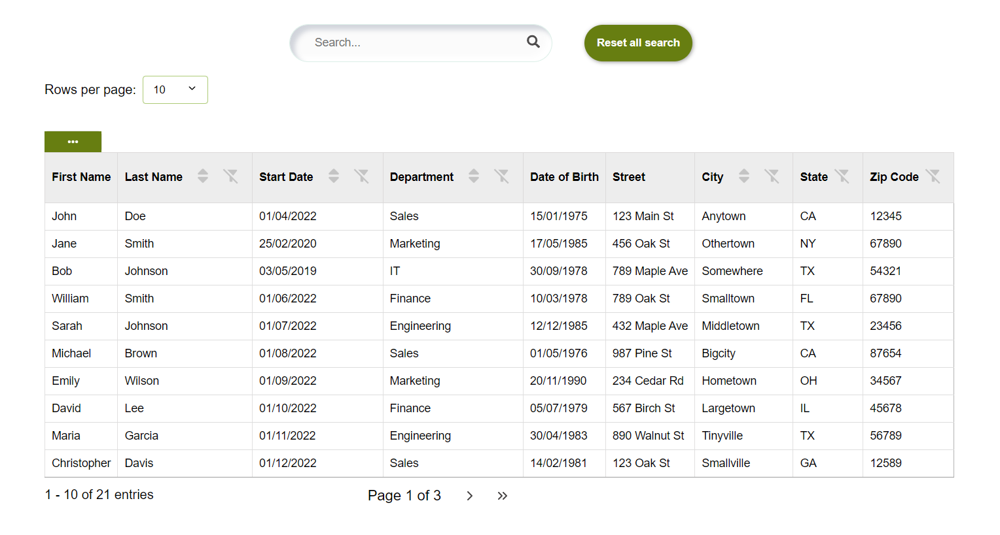
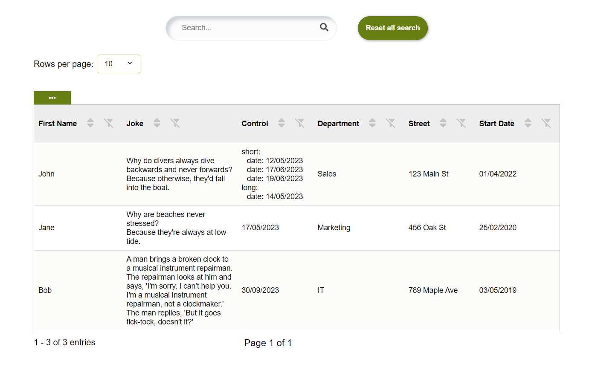

# 'typescript-exportData': A package for easily importing ExportDataComponent dropdown with buttons to export a data of table.

The ExportDataComponent React and typescript component allows you to export table data in various formats. It is 100% customizable, accessible.


ExportDataComponent is an accessible and stylized React and typescript component in the form of a dropdown menu, allowing you to export table data in various formats such as CSV, Excel, and PDF. The number of export formats is customizable and can be tailored to your needs.
this package was specially created to work with the Table component of typescript-table but but it can be used elsewhere.

# Features

  Pre-buid and customize, export data dropDown to:
  - csv, 
  - excel
  - pdf 
  - Customizable
  - Accessible (focus, tabulation and aria-label)

## Install the package 
with npm:

    `npm install file-saver xlsx jspdf jspdf-autotable`

    `npm install typescript-exportData`

or yarn:

    `yarn add typescript-exportData`

## Import in your application

  `import { ExportDataComponent } from 'typescript-exportData';`

  (if you use with <Table/> 'of typescript-table' also import :
  `import {Table} from 'typescript-table'`
  )

Use the component like this with importing ExportDataComponent(dropdown to export data):

  `<ExportDataComponent
      filteredData={filteredData} //don't change this
      columnsManaged={columnsManaged}  //don't change this
      csvExport={true} // to have an export bouton for csv format
      excelExport={true} // to have an export bouton for excel format
      pdfExport={true} // to have an export bouton for pdf format
    />`

## Use ExportDataComponent after install 'typescript-table': 

Exemple with Table and ExportDataComponent.


Install before using buttons's functionality.

`npm install file-saver xlsx jspdf jspdf-autotable`

after
  `import {Table} from 'typescript-table'`
  `import {ExportDataComponent} from 'typescript-exportData'`

  `<Table
      data={datasExample}
      columns={columnsExample}
      renderExportDataComponent={(filteredData,columnsManaged) => (
        <ExportDataComponent
          filteredData={filteredData} //don't change this
          columnsManaged={columnsManaged}  //don't change this
          csvExport={true} // to have an export bouton for csv format
          excelExport={true} // to have an export bouton for excel format
          pdfExport={true} // to have an export bouton for pdf format
        />
      )}
    />`

you can choice to display just one bouton to export, exemple with the pdf button :


    `<Table
          data={datasExample}
          columns={columnsExample}
          renderExportDataComponent={(filteredData, columnsManaged) => (
            <ExportDataComponent
              filteredData={filteredData} // don't change this props
              columnsManaged={columnsManaged} // don't change this props
              pdfExport={true} // just this
            />
          )}
        />`

## Exemple of use
****************************************************************************************************************

```diff	
@@ Example: Table of employees @@
```





****************************************************************************************************************

To use this package, you can use the examples like the data in the following example.


## Customize the style'component

To customize the style of the component, you can increase the specificity of your CSS rules. This means that you can target the component more precisely by adding more specific selectors to your CSS rules.

For example, to change the background color of the th of the table, you can use the following CSS rule

## Hiring the author
If you want to hire my services, don’t hesitate to drop me a line at the email address listed in my GitHub profile.

#### License

This project is licensed under the MIT License - see the [LICENSE]((https://github.com/palacioscaroline/typescript-table/blob/master/LICENSE).) file for details.


